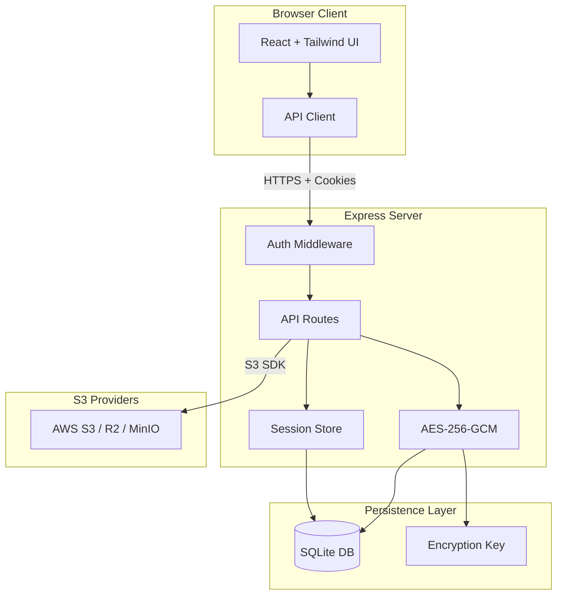

# S3 Explorer

A secure, self-hosted web-based file manager for S3-compatible storage buckets.

[](https://railway.com/deploy/s3-explorer)
[](LICENSE)

---

## Guide

###### • Set PASSWORD: to be atleast 12 characters, one symbol [!,@], one capital letter, two numbers atleast.

 
###### • Example → !Staritongithub20
###### • Set SESSION SECRET: Random 32+ character string.
###### • Example → 9f3c7e2a1b6d4e8f0c5a9d2e7b1a4f6c8d0e3a9b5c7f2e4d6a1c8b9f0e2d


---

  

---

## Overview

Managing S3 buckets often requires command-line tools or provider-specific dashboards that vary significantly in usability. S3 Explorer unifies this experience by offering a single, consistent web interface to upload, download, and organize files across any S3-compatible provider.

**Supported Providers:**

- AWS S3
- Cloudflare R2
- MinIO
- DigitalOcean Spaces
- Any S3-compatible storage

---

## Screenshots

<p>
  
</p>

---

<p>
  
</p>

---

<p>
  
</p>

---

## Architecture



---

## Security Features

| Feature                   | Description                                                              |
| ------------------------- | ------------------------------------------------------------------------ |
| **Password Auth**         | Single password via `APP_PASSWORD` env var (Argon2id hashed)             |
| **Encrypted Credentials** | S3 credentials encrypted at rest with AES-256-GCM                        |
| **Secure Sessions**       | Server-side SQLite sessions with httpOnly/secure/sameSite=strict cookies |
| **Rate Limiting**         | IP-based: 10 attempts per 15 min, 30 min lockout                         |
| **Security Headers**      | Helmet.js enabled (CSP, HSTS, etc.)                                      |
| **No Client Storage**     | Credentials never stored in browser localStorage                         |

---

## Features

### File Management

- Drag-and-drop file uploads
- Create folders for organization
- Rename files and folders
- Delete files and folders with confirmation
- Download files using secure presigned URLs

### Multi-Connection Support

- Store up to 100 S3 connections
- Instant switching between connections
- All credentials encrypted server-side

### Keyboard Navigation

| Shortcut           | Action                  |
| ------------------ | ----------------------- |
| `Cmd+K` / `Ctrl+K` | Open command palette    |
| `Cmd+,` / `Ctrl+,` | Open connection manager |
| `Escape`           | Close active modal      |

---

## Deployment

### Railway (Recommended)

[](https://railway.com/deploy/s3-explorer)

1. Fork repo
2. New project → Deploy from GitHub
3. Add volume: mount path `/data`
4. Set environment variables:
   - `APP_PASSWORD` - Strong password (12+ chars, mixed case, numbers, symbols)
   - `SESSION_SECRET` - Random 32+ character string (use `openssl rand -hex 32`)

### Docker

```bash
docker run -d \
  -p 3000:3000 \
  -e APP_PASSWORD='YourStr0ng!Pass#2024' \
  -e SESSION_SECRET='your-random-32-char-session-secret' \
  -v s3explorer_data:/data \
  ghcr.io/subratomandalme/s3-explorer:latest
```

### Docker Compose

```yaml
version: "3.8"
services:
  s3-explorer:
    build: .
    ports:
      - "3000:3000"
    environment:
      - APP_PASSWORD=YourStr0ng!Pass#2024
      - SESSION_SECRET=change-this-to-random-32-chars
    volumes:
      - s3explorer_data:/data

volumes:
  s3explorer_data:
```

### Local Development

```bash
# Install dependencies
npm install
cd apps/client && npm install
cd ../server && npm install

# Set environment
export APP_PASSWORD='DevPassword123!'
export SESSION_SECRET='dev-session-secret-32-characters!'
export DATA_DIR='./data'

# Run development servers
cd apps/server && npm run dev  # Backend on :3000
cd apps/client && npm run dev  # Frontend on :5173
```

---

## Environment Variables

| Variable         | Required | Description                                                               |
| ---------------- | -------- | ------------------------------------------------------------------------- |
| `APP_PASSWORD`   | Yes      | Login password. Must be 12+ chars with upper, lower, number, special char |
| `SESSION_SECRET` | Yes      | Session signing key. Use `openssl rand -hex 32`                           |
| `DATA_DIR`       | No       | SQLite/key storage path. Default: `/data`                                 |
| `PORT`           | No       | Server port. Default: `3000`                                              |
| `NODE_ENV`       | No       | Environment (`production` / `development`)                                |

---

## Provider Setup Guide

### Cloudflare R2

1. Go to **Cloudflare Dashboard → R2 Object Storage**
2. Click **Manage R2 API Tokens**
3. Create token with **Admin Read & Write** permissions
4. Use values:
   - **Endpoint**: `https://<account_id>.r2.cloudflarestorage.com`
   - **Access Key**: Your R2 Access Key ID
   - **Secret Key**: Your R2 Secret Access Key

### AWS S3

1. Go to **AWS Console → IAM**
2. Create user with `AmazonS3FullAccess` policy
3. Create access key under **Security Credentials**
4. Use values:
   - **Endpoint**: `https://s3.<region>.amazonaws.com`
   - **Access Key**: Generated Access Key ID
   - **Secret Key**: Generated Secret Access Key

### MinIO

1. Access your MinIO console
2. Navigate to **Access Keys**
3. Create new access key
4. Use values:
   - **Endpoint**: Your MinIO URL (e.g., `https://minio.example.com`)
   - **Access Key**: Generated Access Key
   - **Secret Key**: Generated Secret Key

---

## Stack

- **Frontend**: React, Tailwind, Vite
- **Backend**: Express, TypeScript
- **Database**: SQLite (better-sqlite3)
- **Auth**: Argon2, express-session

---

## License

MIT

---

Created by [@subratomandal](https://github.com/subratomandal)
