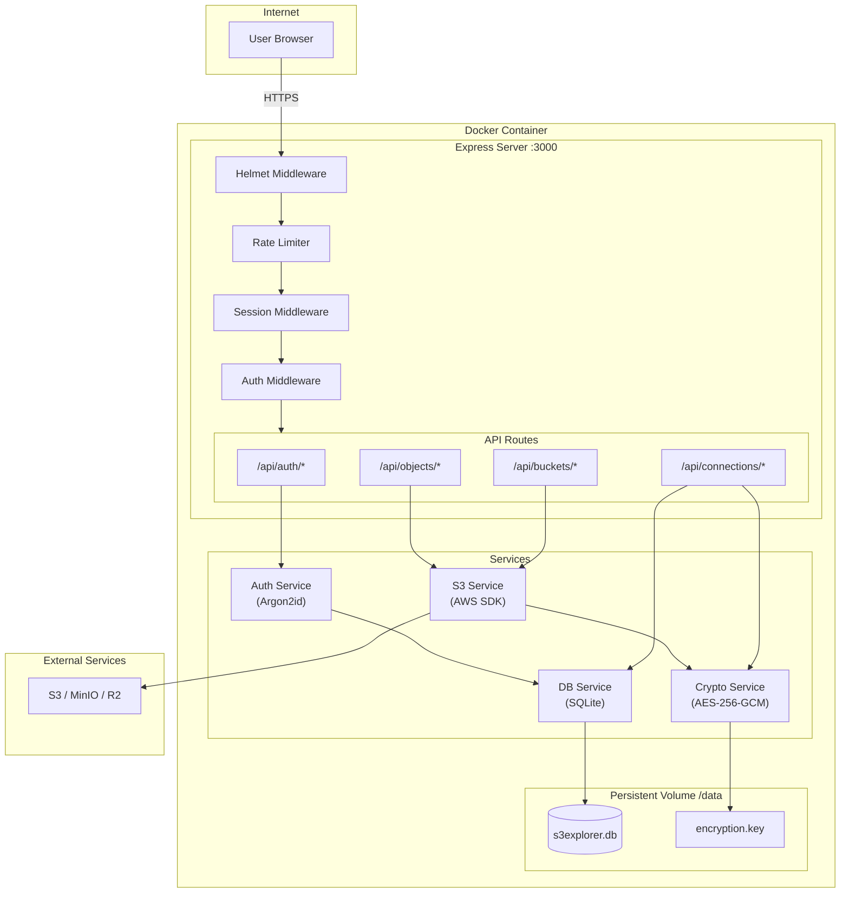
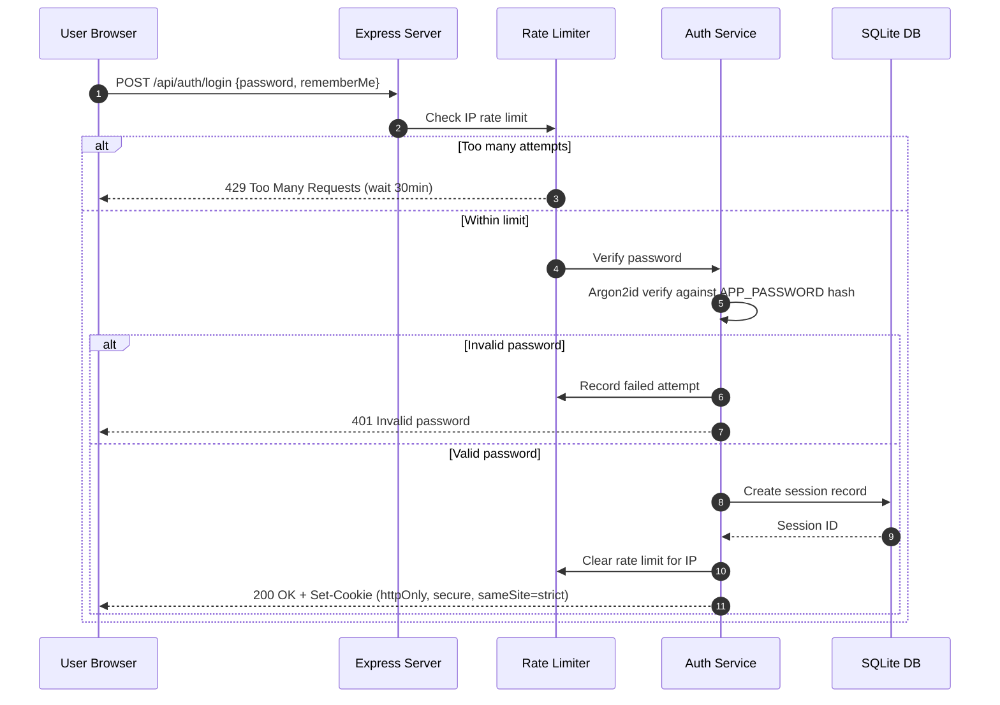
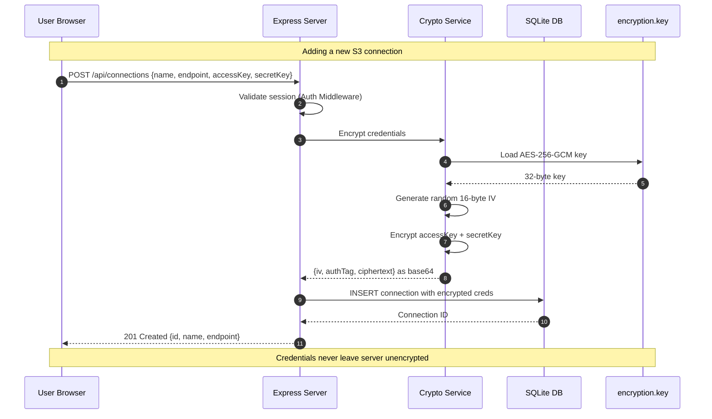
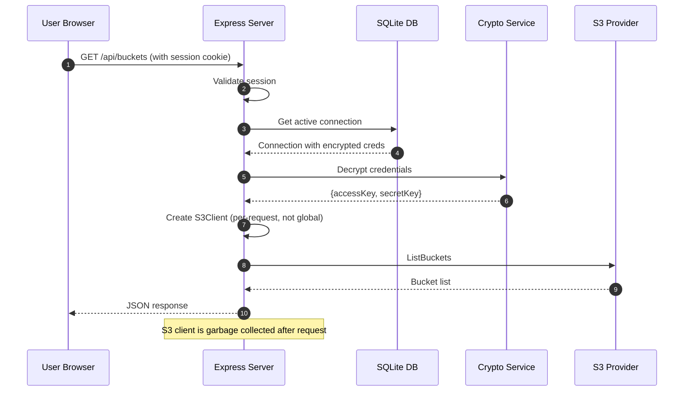

# S3 Explorer Security Architecture Specification

> **Version**: 2.0  
> **Date**: January 2026  
> **Status**: Implemented

---

## Table of Contents

1. [Executive Summary](#executive-summary)
2. [Problem Statement](#problem-statement)
3. [Architecture Overview](#architecture-overview)
4. [Security Model](#security-model)
5. [Data Flow Diagrams](#data-flow-diagrams)
6. [Implementation Details](#implementation-details)
7. [Q&A / Design Decisions](#qa--design-decisions)
8. [Threat Model](#threat-model)
9. [File Reference](#file-reference)

---

## Executive Summary

This document describes the security architecture redesign of S3 Explorer, transforming it from an insecure prototype into a production-ready, self-hosted S3 file browser with proper authentication, encryption, and session management.

### Key Changes

| Before                      | After                               |
| --------------------------- | ----------------------------------- |
| No authentication           | Password auth with Argon2id         |
| Credentials in localStorage | AES-256-GCM encrypted at rest       |
| No sessions                 | SQLite-backed server sessions       |
| CORS wide open              | Strict same-origin with credentials |
| Global mutable state        | Per-request S3 client from DB       |
| No rate limiting            | IP-based rate limiting              |

---

## Problem Statement

### Original Security Audit Findings

The initial audit identified **12 critical/high/medium issues**:

```
CRITICAL:
1. No authentication - anyone with URL has full access
2. S3 credentials stored in browser localStorage (XSS = full compromise)
3. Credentials sent in request body on every API call
4. CORS allows any origin with credentials

HIGH:
5. No session management
6. No HTTPS enforcement
7. Global mutable S3 client state (race conditions)
8. No input validation on bucket/object names

MEDIUM:
9. No rate limiting on sensitive operations
10. No security headers (CSP, HSTS, etc.)
11. Verbose error messages leak internal details
12. No audit logging
```

### Design Constraints

- **Single-user**: No multi-tenancy complexity
- **Self-hosted**: User controls their own instance
- **Railway deployment**: Must work with Railway volumes
- **Internet-exposed**: Accessible over HTTPS
- **Minimal dependencies**: Keep attack surface small

---

## Architecture Overview

### System Architecture



### Component Responsibilities

| Component              | Responsibility                                           |
| ---------------------- | -------------------------------------------------------- |
| **Helmet**             | Security headers (CSP, HSTS, X-Frame-Options, etc.)      |
| **Rate Limiter**       | Prevent brute force (10 attempts/15min, 30min lockout)   |
| **Session Middleware** | Manage httpOnly cookies, link to SQLite store            |
| **Auth Middleware**    | Verify session validity, reject unauthenticated requests |
| **Auth Service**       | Password verification with Argon2id                      |
| **Crypto Service**     | AES-256-GCM encrypt/decrypt for S3 credentials           |
| **DB Service**         | SQLite operations, session store implementation          |
| **S3 Service**         | Create per-request S3 clients from decrypted credentials |

---

## Security Model

### Authentication Flow



### S3 Credential Storage Flow



### S3 Request Flow



---

## Implementation Details

### Password Security

**Algorithm**: Argon2id (memory-hard, GPU-resistant)

```typescript
// Password is never stored - only compared at runtime
const APP_PASSWORD = process.env.APP_PASSWORD; // Required env var

// Verification uses Argon2id with:
// - Memory: 64 MB
// - Iterations: 3
// - Parallelism: 4
await argon2.verify(storedHash, providedPassword);
```

**Why Argon2id?**

- Winner of Password Hashing Competition (2015)
- Resistant to GPU/ASIC attacks (memory-hard)
- Resistant to side-channel attacks (Argon2id variant)
- Recommended by OWASP for password storage

### Credential Encryption

**Algorithm**: AES-256-GCM (authenticated encryption)

```typescript
// Key: 256-bit, generated once, stored in /data/encryption.key
// IV: 128-bit, unique per encryption (stored with ciphertext)
// Auth Tag: 128-bit (prevents tampering)

interface EncryptedData {
  iv: string; // Base64 encoded 16 bytes
  authTag: string; // Base64 encoded 16 bytes
  ciphertext: string; // Base64 encoded encrypted data
}
```

**Why AES-256-GCM?**

- Industry standard for authenticated encryption
- Provides confidentiality AND integrity
- Fast with hardware acceleration (AES-NI)
- Auth tag prevents tampering without detection

### Session Management

**Storage**: SQLite with custom express-session store

```typescript
// Session cookie settings
{
  httpOnly: true,      // Not accessible via JavaScript
  secure: true,        // HTTPS only (in production)
  sameSite: 'strict',  // No cross-site requests
  maxAge: rememberMe ? 7 * 24 * 60 * 60 * 1000 : 24 * 60 * 60 * 1000
}
```

**Why server-side sessions?**

- Session data never leaves server
- Can invalidate sessions server-side
- No JWT signature verification overhead
- Smaller cookie size (just session ID)

### Rate Limiting

**Strategy**: IP-based with escalating lockout

```typescript
// Configuration
const MAX_ATTEMPTS = 10; // Per 15-minute window
const WINDOW_MS = 15 * 60 * 1000; // 15 minutes
const LOCKOUT_MS = 30 * 60 * 1000; // 30 minutes

// Stored in SQLite rate_limits table
interface RateLimit {
  ip: string;
  attempts: number;
  first_attempt: number; // Unix timestamp
  blocked_until: number | null;
}
```

---

## Q&A / Design Decisions

### Why single password instead of username/password?

**Q**: Why not implement full user authentication with usernames?

**A**: This is a **single-user, self-hosted** application. Adding usernames would:

1. Increase complexity without benefit (only one user)
2. Require additional storage and validation
3. Create username enumeration attack surface

The password is set via environment variable (`APP_PASSWORD`), which:

- Is configured at deploy time by the instance owner
- Never stored in code or database
- Can be changed by redeploying with new env var

---

### Why SQLite instead of PostgreSQL/Redis?

**Q**: Why use SQLite for sessions and connections?

**A**:

1. **Zero configuration**: No separate database service needed
2. **Single file**: Easy backup (`/data/s3explorer.db`)
3. **Railway volumes**: Works perfectly with persistent volumes
4. **Performance**: More than sufficient for single-user workload
5. **Reliability**: ACID compliant, WAL mode for durability

SQLite handles thousands of requests/second - far more than a single user needs.

---

### Why encrypt at rest if the key is on the same disk?

**Q**: If `encryption.key` is on the same volume as `s3explorer.db`, what's the point?

**A**: Defense in depth:

1. **Database dump protection**: If someone gets a database backup (without the key file), credentials are useless
2. **Log protection**: Encrypted creds in logs are meaningless
3. **Separation of concerns**: Key can be rotated independently
4. **Railway-specific**: Volume snapshots might not include all files

In higher security environments, the key could be:

- Stored in a secrets manager
- Derived from a hardware security module
- Loaded from environment variable

---

### Why Argon2id instead of bcrypt?

**Q**: bcrypt is battle-tested. Why Argon2?

**A**:

| Feature                 | bcrypt   | Argon2id                      |
| ----------------------- | -------- | ----------------------------- |
| Memory hardness         | No       | Yes (64MB default)            |
| GPU resistance          | Moderate | Strong                        |
| Side-channel resistance | No       | Yes                           |
| Modern standard         | Legacy   | PHC winner, OWASP recommended |
| Tunability              | Limited  | Memory, time, parallelism     |

bcrypt was designed in 1999. Argon2 was designed specifically to resist modern GPU/ASIC attacks.

---

### Why not use JWT tokens?

**Q**: JWTs are stateless and scalable. Why server sessions?

**A**: For a **single-user self-hosted app**, JWTs add complexity without benefit:

| Concern    | JWT                                    | Server Session             |
| ---------- | -------------------------------------- | -------------------------- |
| Revocation | Complex (blacklists)                   | Simple (delete from DB)    |
| Size       | Large (payload + signature)            | Small (just session ID)    |
| Validation | Crypto on every request                | DB lookup (cached)         |
| Scaling    | Better for distributed                 | Fine for single instance   |
| Security   | Token theft = full access until expiry | Can invalidate immediately |

Server sessions are simpler and more secure for this use case.

---

### Why is there no CSRF protection?

**Q**: Shouldn't there be CSRF tokens?

**A**: CSRF protection is provided by:

1. **`sameSite: 'strict'`** cookies - Browser won't send cookies on cross-site requests
2. **Credentials required** - API requires valid session cookie
3. **Same-origin API** - Frontend and backend on same origin

Modern browsers with `sameSite=strict` make traditional CSRF attacks impossible. The cookie simply isn't sent on cross-origin requests.

---

### Why 100 connection limit?

**Q**: Why limit to 100 S3 connections?

**A**: Practical limits for single-user scenario:

1. **UI sanity**: 100 connections is already hard to manage
2. **Database size**: Each connection ~1KB encrypted = 100KB total
3. **Memory**: Loading all connections for UI is bounded
4. **Abuse prevention**: Prevents using instance as credential storage

Can be increased by changing `MAX_CONNECTIONS` constant if needed.

---

### Why not use environment variables for S3 credentials?

**Q**: The old version used env vars. Why change to database storage?

**A**: Multi-connection support:

| Feature              | Env Vars                 | Database             |
| -------------------- | ------------------------ | -------------------- |
| Multiple connections | Complex (S3*1*_, S3*2*_) | Natural (rows)       |
| Add at runtime       | Requires restart         | Instant              |
| Encryption           | Plain text in env        | AES-256-GCM          |
| Backup               | External config mgmt     | Part of /data volume |

Environment variables are still used for `APP_PASSWORD` and `SESSION_SECRET` because:

- They're instance-level secrets, not user data
- They should never be stored in the database
- They're set once at deploy time

---

## Threat Model

### Assets Protected

1. **S3 Credentials**: Access keys and secret keys for cloud storage
2. **S3 Data**: Files stored in connected buckets
3. **Session State**: User's authenticated session

### Threats Mitigated

| Threat                             | Mitigation                                       |
| ---------------------------------- | ------------------------------------------------ |
| **Unauthorized access**            | Password authentication required                 |
| **Brute force**                    | Rate limiting (10 attempts/15min, 30min lockout) |
| **Session hijacking**              | httpOnly, secure, sameSite=strict cookies        |
| **XSS credential theft**           | Credentials never in browser/localStorage        |
| **Credential exposure in transit** | HTTPS only, credentials never in request body    |
| **Credential exposure at rest**    | AES-256-GCM encryption                           |
| **CSRF attacks**                   | sameSite=strict cookies                          |
| **Clickjacking**                   | X-Frame-Options, CSP headers via Helmet          |

### Accepted Risks

| Risk                  | Acceptance Rationale                                                               |
| --------------------- | ---------------------------------------------------------------------------------- |
| **Server compromise** | If attacker has server access, all bets are off. Encryption key is on same volume. |
| **Weak password**     | User responsibility. Minimum requirements enforced (12+ chars, complexity).        |
| **Network MITM**      | Requires HTTPS in production. User must configure TLS.                             |

---

## File Reference

### New Files Created

| File                                               | Purpose                                                |
| -------------------------------------------------- | ------------------------------------------------------ |
| `apps/server/src/services/db.ts`                   | SQLite database, session store, CRUD operations        |
| `apps/server/src/services/crypto.ts`               | AES-256-GCM encryption/decryption                      |
| `apps/server/src/middleware/auth.ts`               | Argon2 verification, rate limiting, session management |
| `apps/server/src/routes/auth.ts`                   | `/api/auth/login`, `/logout`, `/status` endpoints      |
| `apps/server/src/routes/connections.ts`            | CRUD for encrypted S3 connections                      |
| `apps/client/src/components/LoginPage.tsx`         | Password login UI                                      |
| `apps/client/src/components/ConnectionManager.tsx` | S3 connection management UI                            |

### Modified Files

| File                                | Changes                                          |
| ----------------------------------- | ------------------------------------------------ |
| `apps/server/src/index.ts`          | Added Helmet, sessions, auth middleware          |
| `apps/server/src/services/s3.ts`    | Per-request client from encrypted DB credentials |
| `apps/server/src/routes/buckets.ts` | Input validation, auth required                  |
| `apps/server/src/routes/objects.ts` | Input validation, auth required                  |
| `apps/client/src/api.ts`            | `credentials: 'include'`, auth endpoints         |
| `apps/client/src/App.tsx`           | Auth wrapper, removed localStorage credentials   |
| `Dockerfile`                        | Multi-stage build, /data volume                  |
| `docker-compose.yml`                | Required env vars, volume mount                  |

### Deleted Files

| File                                                           | Reason                                         |
| -------------------------------------------------------------- | ---------------------------------------------- |
| `apps/server/src/routes/config.ts`                             | Replaced by `/api/connections` with encryption |
| `apps/client/src/components/modals/ConnectionManagerModal.tsx` | Replaced by `ConnectionManager.tsx`            |

---

## Conclusion

This security architecture transforms S3 Explorer from an insecure prototype into a production-ready application suitable for internet deployment. The design prioritizes:

1. **Simplicity**: Single-user model avoids unnecessary complexity
2. **Defense in depth**: Multiple layers of protection
3. **Modern standards**: Argon2id, AES-256-GCM, strict cookies
4. **Operational ease**: SQLite, Docker volumes, environment variables

The architecture balances security with usability for a self-hosted, single-user S3 file browser.
